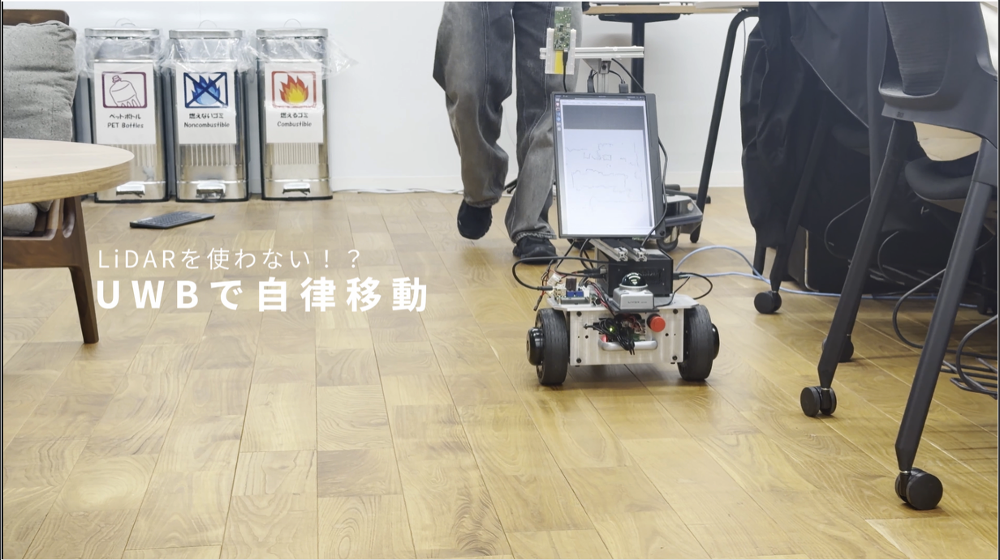

# Robust Global Localization and Autonomous Navigation using UWB and Sensor Fusion
Last updated: 14 Feb 2026


A short video and overview are available below.

[Watch video](https://s3-ap-northeast-1.amazonaws.com/mp4.video.honko.kanazawa-it.ac.jp/20251118nakazawa_jiritsu.mp4)

Video source: [Kanazawa Institute of Technology — Nakazawa Lab exhibition at International Robot Exhibition 2025](https://www.kanazawa-it.ac.jp/kitnews/2025/1118_nakazawa.html)

## Achievements
- Presented at the 205th Multimedia Communications and Distributed Processing Research Meeting: [DPS205](https://www.ipsj.or.jp/kenkyukai/event/dps205.html)
- Exhibition at the International Robot Exhibition 2025
- Featured in media "物語の始まりへ"

License: MIT License

## Research Summary
"Keep moving even where radio coverage dies." 

This package provides robust localization and autonomous navigation by fusing UWB (Ultra-Wideband) and wheel odometry.

The main strength is dynamic UWB reliability adjustment using nLOS (non-Line-Of-Sight) detection. When nLOS is detected, the EKF down-weights UWB and prioritizes wheel odometry. This allows the robot to continue safe autonomous navigation even in factory areas or radio-degraded zones.

## Background
| 1) Industry DX is advancing | 2) Many AMRs use LiDAR | 3) LiDAR has limitations |
|---|---|---|
|  |  |  |

LiDAR-based AMRs are currently the industry de facto standard. At the 2025 International Robot Exhibition we found many vendors using LiDAR as a default.

However, LiDAR struggles in environments with few features. We discussed applications such as tunnel autonomous driving and navigation inside large tanks — both have few recognizable features. We explored UWB as a complementary ranging method to enable stable autonomy in such environments.

More info: https://www.automation-news.jp/2023/09/75132/

## Algorithm Overview
The system is based on an Extended Kalman Filter (EKF) to handle nonlinear inputs.


- Prediction: wheel odometry
- Correction: UWB range measurements
- 3D correction: raw UWB slant ranges are converted to horizontal distances using the configured `anchor_height` and `tag_height` before being used in the filter.

## Experimental Hardware
| Device | Description |
|---|---|
| Megarover Ver3.0 | Test platform with built-in wheel odometry encoders |
| Type2BP EVK | UWB developer kit (Murata) |
| Kachaka | Used for mapping |
| Livox MID360 | Used for experimental comparison |

## Repository Layout

### Main programs
- `ekf_with_serial.launch.py`: Core localization; launches serial comms and the filter.
- `uwb_nav.launch.py`: Runs autonomous navigation using Nav2. (Start `ekf_with_serial.launch.py` first.)

### Tools and scripts
- `rviz_anchor_place.py`: Anchor placement tool. Click on the map in Rviz to save anchor coordinates to `anchors.yaml`.
- `experiment_gui.py`: GUI used during paper experiments.
- `get_map.py`: Fetches map files via the Kachaka API.
- `serialandFilter.py` / `serialAndFliterPublisher.py`: Handles serial communication and data preprocessing.
- `uwb_ekf_node.py`: Core algorithm implementation.

### Parameters and data
- `maps/`: Kachaka-generated map files used in experiments.
- `param/anchors.yaml`: Anchor positions.
- `param/nav2_params_uwb.yaml`: Nav2 configuration tuned for UWB navigation (AMCL removed).

## Usage

### 1. Preparation
Clone and build the workspace:

```bash
git clone https://github.com/Takuchan/opencampus_robot.git
colcon build
source install/setup.bash
```

- Create a map of the environment (this project used Kachaka).
- Place the resulting `map.pgm` and `map.yaml` into the `tk_uwb_ekf/maps` folder.
- Ensure the `image` field in `map.yaml` points to `map.pgm`.

Finally, run:

```bash
colcon build
```

### 2. Anchor placement
Before autonomous navigation, set anchor coordinates as follows.

#### Get anchor coordinates
With Rviz2 running, start `rviz_anchor_place.launch.py` to display the map in Rviz. If the map does not appear, start `uwb_nav.launch.py` first.
1. Click the **Publish Point** tool in Rviz.
2. Touch the map in order for the UWB anchor IDs (A0, A1, ...) to set their locations.
3. When finished, the GUI will show "Ready to save." Click **Save Anchors** to write to `~/ros2_ws/install/tk_uwb_ekf/share/tk_uwb_ekf/param/anchors.yaml`.
4. **Important:** Copy that file into `ros2_ws/src/tk_uwb_ekf/params` and run `colcon build` again.

#### Height settings
UWB measures slant ranges; incorrect height settings will degrade localization accuracy. Specify heights in meters in `param/anchors.yaml`.

- `anchor_height`: anchor installation height (default: 0.0)
- `tag_height`: tag height on the robot (default: 0.0)

Example launch with heights:

```bash
ros2 launch tk_uwb_ekf uwb_nav.launch.py anchor_height:=1.43 tag_height:=0.69
```

### 3. Startup sequence
1. Power and serial connection to the rover
2. Publish wheel odometry
3. Use IMU
4. Start the localization and navigation stack

```bash
ros2 run micro_ros_agent micro_ros_agent serial --dev /dev/ttyUSB0 -v4
ros2 launch megarover3_bringup robot.launch.py
ros2 launch oc_megarover_bringup bringup.launch.py
ros2 run tf2_ros static_transform_publisher 0 0 0 0 0 0 map odom
ros2 launch tk_uwb_ekf uwb_nav.launch.py
```

If you need an English translation of additional sections, or want this file adjusted for publishing (badges, table of contents, or license text), tell me which parts to expand.
